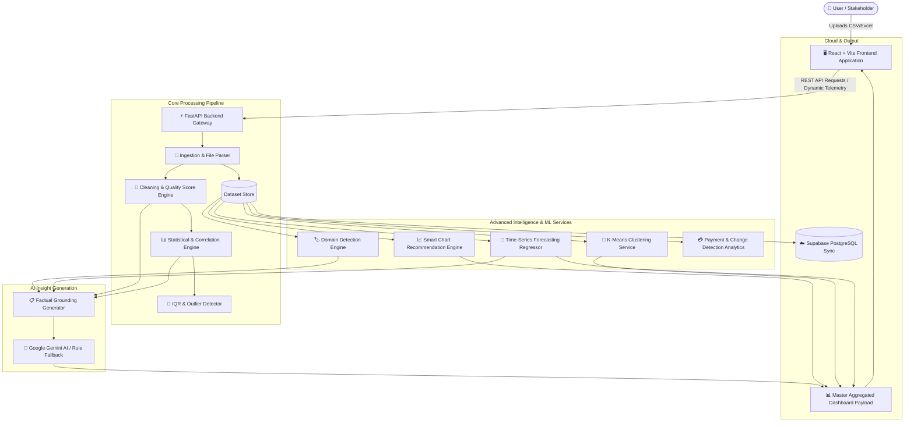

# 🚀 Clarion Data – Automated Insight Analyst

> **Transforming raw spreadsheet datasets into actionable domain intelligence, machine learning forecasts, smart visualizations, and AI-powered insights in seconds.**

<p align="center">
  
  
  
  
  
  
  
  
</p>

---

## 📌 Problem Statement

Organizations and teams generate massive amounts of spreadsheet-style data every day. However, extracting actionable value from raw data typically requires:
* Manual data cleaning, deduplication, and missing value handling.
* In-depth statistical modeling and correlation analysis.
* Specialized expertise in machine learning and time-series forecasting.
* Manual chart configuration and design.

This creates a high technical barrier, making analytical discovery **slow, error-prone, and inaccessible** for non-technical stakeholders and business teams.

**Clarion Data** solves this problem by automating the entire data discovery lifecycle — taking any raw CSV or spreadsheet dataset and instantly generating structural audits, statistical summaries, predictive forecasts, recommended visualizations, anomaly alerts, and fact-grounded natural language insights.

---

## 💡 Solution

Clarion Data is an **end-to-end intelligent data analysis platform** that bridges the gap between raw data and decision-making.

```text
Upload Dataset
      ↓
Automatic Data Processing & Ingestion
      ↓
Data Cleaning & Statistical Analysis
      ↓
Machine Learning & Pattern Detection (Clustering + Forecasting)
      ↓
Smart Visualization Recommendations
      ↓
AI-Generated Executive Insights (Gemini LLM + Rule Fallback)
      ↓
Interactive High-Telemetry Dashboard & Cloud Sync
```

---

## ✨ Key Features

| Feature Area | Description |
| :--- | :--- |
| **📂 Smart Dataset Upload** | Ingest CSV and Excel (`.xlsx`) datasets seamlessly with instant schema parsing and memory profiling. |
| **🔍 Data Exploration** | Comprehensive row/column breakdown, automated data type detection, missing value analysis, and duplicate row audits. |
| **📊 Statistical Analysis** | Computes descriptive stats: mean, median, standard deviation, min/max, skewness, and Pearson correlation matrices with strong pair identification. |
| **🚨 Outlier Detection** | Automated IQR (Interquartile Range) boundary tracking and Isolation Forest machine learning anomaly identification. |
| **🧠 AI-Powered Insights** | Natural language executive summaries generated via Google Gemini AI, backed by a deterministic rule-based fallback system. |
| **🤖 Machine Learning Predictions** | Time-series forecasting regressor with automated trend extrapolation, test/train splitting, and validation metrics ($MAE$, $RMSE$, $R^2$). |
| **🎯 Automatic Clustering** | Unsupervised K-Means clustering to uncover hidden customer cohorts, segmentations, and operational patterns. |
| **📈 Smart Visualization Engine** | Context-aware chart recommendation system supporting interactive Line, Bar, Scatter, and Histogram plots. |
| **🏷️ Automatic Domain Detection** | Heuristic domain classification engine identifying **Sales**, **Payments**, **Marketing**, **Healthcare**, or **General** datasets. |
| **💳 Payment Analytics** | Financial intelligence tracking total revenue, completed vs. failed payments, settlement ratios, and historical daily velocity. |
| **🔄 Change Detection** | Time-based delta comparisons tracking percentage changes across daily, weekly, and monthly periods alongside emerging categories. |
| **⭐ Data Quality Score** | Comprehensive 4-factor data quality score (0–100) paired with an intuitive letter grade (**A–F**) covering completeness, duplicates, and validity. |
| **🔔 Smart Notifications** | Automated multi-level alert engine categorizing dataset findings into **Informational**, **Warning**, and **Critical** events. |
| **📊 Interactive Dashboard** | Centralized, dark-mode telemetry dashboard displaying KPIs, interactive copilot drawer, chart switchers, and Supabase cloud export. |

---

## 🛠️ Technology Stack

| Layer | Technologies | Purpose |
| :--- | :--- | :--- |
| **Frontend** | React 18, Vite, Tailwind CSS, Lucide Icons | Responsive high-telemetry UI, copilot drawer, and theme engine |
| **Backend API** | Python 3.11+, FastAPI, Uvicorn, Pydantic v2 | High-throughput asynchronous REST API & schema validation |
| **Data & ML** | Pandas, NumPy, Scikit-learn, OpenPyXL | Ingestion, IQR filtering, K-Means clustering, forecasting regression |
| **AI / LLM** | Google Gemini API (`google-genai`), Rule Engine | Natural language insight generation with deterministic fallback |
| **Visualizations** | Plotly-Compatible Chart Schema, Recharts | Interactive dynamic charting & multi-view visual switcher |
| **Cloud Sync** | Supabase REST / PostgREST (PostgreSQL) | Automated PostgreSQL table DDL generation and streaming batch inserts |
| **Testing** | Pytest, Pytest-Asyncio, HTTPX | 315+ automated unit and end-to-end integration tests |

---

## 🏗️ System Architecture



---

## 📁 Project Structure

```
clarion-data/
├── api/                           # FastAPI REST route controllers
│   ├── person1_api.py             # Core analytical endpoints (Upload, Stats, Schema, Cleaning)
│   ├── clustering_api.py          # Machine learning clustering endpoints
│   ├── prediction_api.py          # Time-series forecasting endpoints
│   ├── visualization_api.py       # Chart recommendation & options endpoints
│   ├── intelligence_api.py        # Domain detection, payment analytics, change detection
│   ├── insight_api.py             # AI summaries, notifications, quality score
│   ├── dashboard_api.py           # Master aggregated dashboard endpoint
│   ├── chat_api.py                # Interactive AI Copilot chat router
│   └── supabase_api.py            # Supabase database sync & DDL generator
│
├── services/                      # Analytical and Machine Learning business logic
│   ├── dataset_store.py           # In-memory session & dataset registry
│   ├── cleaning_service.py        # Missing values, duplicates, and type casting
│   ├── analysis_service.py        # Numeric descriptive statistics & distributions
│   ├── correlation_service.py     # Pearson correlation matrix & strong pairs
│   ├── outlier_service.py         # IQR and Isolation Forest anomaly detection
│   ├── clustering.py              # Automatic K-Means clustering algorithm
│   ├── predictor.py               # Time-series forecasting regressor
│   ├── chart_engine.py            # Plotly-compatible chart generator
│   ├── domain_detector.py         # Heuristic domain classification engine
│   ├── payment_analytics.py       # Financial payment metrics & daily trends
│   ├── change_detector.py         # Daily/Weekly/Monthly delta comparator
│   ├── quality_score.py           # 4-factor data health scoring engine
│   ├── notification_engine.py     # Multi-level alert generator
│   ├── summary_generator.py       # Gemini AI & rule-based insight generator
│   └── supabase_service.py        # Cloud PostgreSQL migration & sync service
│
├── models/                        # Pydantic request and response schemas
│   └── schemas.py                 # Type-safe API contracts
│
├── insight-analyst-app/           # React + Vite frontend application
│   ├── src/
│   │   ├── components/            # Headers, sidebar, telemetry ribbons, modals, drawers
│   │   ├── views/                 # Dashboard, Quality, Schema, Reports, Pipelines
│   │   ├── context/               # Telemetry and state management
│   │   └── services/              # Axios/Fetch API client layer
│   ├── package.json
│   └── vite.config.js
│
├── tests/                         # Pytest test suite (315+ passing tests)
├── static/                        # Developer UI and static web assets
├── main.py                        # FastAPI application server entrypoint
├── requirements.txt               # Backend Python dependencies
├── .env.example                   # Environment configuration template
└── README.md                      # Project documentation
```

---

## ⚡ API Highlights

| Endpoint | Method | Description |
| :--- | :---: | :--- |
| `/upload` | `POST` | Ingest raw CSV or Excel dataset file |
| `/dataset/{id}/overview` | `GET` | Retrieve row count, column count, memory usage, and sample data |
| `/dataset/{id}/schema` | `GET` | Detected column datatypes, null counts, and unique value ratios |
| `/dataset/{id}/cleaning-report` | `GET` | Missing value audit, duplicate counts, and applied imputations |
| `/dataset/{id}/analysis` | `GET` | Comprehensive statistical summary (mean, std, min, median, max, skewness) |
| `/dataset/{id}/correlations` | `GET` | Pearson correlation matrix and strongly correlated column pairs |
| `/dataset/{id}/outliers` | `GET` | IQR-based outlier thresholds, affected row counts, and anomaly indices |
| `/dataset/{id}/clusters` | `GET` | Automatic K-Means clustering assignments and cohort characteristics |
| `/dataset/{id}/predictions` | `GET` | Predictive time-series forecast with confidence metrics ($MAE$, $RMSE$, $R^2$) |
| `/dataset/{id}/charts` | `GET` | Top 2–4 recommended Plotly-compatible chart configurations |
| `/dataset/{id}/domain` | `GET` | Detected domain (Sales, Payments, Healthcare, etc.) with reasoning evidence |
| `/dataset/{id}/summary` | `GET` | Fact-grounded natural language executive summary via Gemini AI |
| `/dataset/{id}/notifications` | `GET` | Automated severity-rated alert notifications (Info, Warning, Critical) |
| `/dataset/{id}/data-quality` | `GET` | Overall health score (0–100), letter grade (A–F), and factor breakdown |
| `/dataset/{id}/dashboard` | `GET` | Single-request master payload for instant dashboard rendering |
| `/chat/query` | `POST` | Natural language conversational Q&A over the active dataset |
| `/supabase/verify` | `POST` | Test connection to Supabase cloud PostgreSQL project |
| `/supabase/dataset/{id}/sql` | `GET` | Generate optimized PostgreSQL `CREATE TABLE` DDL for dataset |
| `/supabase/dataset/{id}/push` | `POST` | Batched streaming insert of dataset rows into Supabase table |

---

## 🔄 How It Works

```
1. Upload       ➔  User uploads a CSV or Excel dataset via drag-and-drop.
2. Ingestion    ➔  FastAPI validates file integrity and registers the dataset in memory.
3. Structure    ➔  Schema engine detects field types, null distributions, and duplicates.
4. Cleaning     ➔  Automated cleaning imputes missing data and standardizes datatypes.
5. Statistics   ➔  Calculates descriptive metrics, skewness, and correlation pairs.
6. ML Engine    ➔  Executes K-Means clustering and builds time-series regression forecasts.
7. Visuals      ➔  Recommends optimal interactive visualizations tailored to the data.
8. AI Copilot   ➔  Grounds dataset facts and prompts Gemini AI for an executive summary.
9. Dashboard    ➔  Frontend renders a centralized dashboard with live telemetry.
```

---

## 🚀 Installation & Setup

### Prerequisites
* **Python**: `3.11` or higher
* **Node.js**: `v18` or higher
* **npm** or **yarn**

### 1. Clone the Repository
```bash
git clone https://github.com/gharatved41-oss/Clarion-Data.git
cd Clarion-Data
```

### 2. Backend Setup
```bash
# Create and activate Python virtual environment
python -m venv venv

# Windows (PowerShell):
.\venv\Scripts\Activate.ps1
# Linux / macOS:
source venv/bin/activate

# Install Python dependencies
pip install -r requirements.txt
```

### 3. Environment Configuration
Create a `.env` file in the root directory (see template below):
```bash
cp .env.example .env
```

### 4. Frontend Setup
```bash
cd insight-analyst-app
npm install
npm run build
cd ..
```

### 5. Run the Application Locally

#### Option A: Unified Full-Stack Server (FastAPI + Built React UI)
```bash
python main.py
```
* **Application UI**: [http://localhost:8000](http://localhost:8000)
* **Interactive API Docs (Swagger)**: [http://localhost:8000/docs](http://localhost:8000/docs)
* **Alternative ReDoc**: [http://localhost:8000/redoc](http://localhost:8000/redoc)

#### Option B: Frontend Hot-Reload Development Server
```bash
# Terminal 1 (Backend):
uvicorn main:app --reload --port 8000

# Terminal 2 (Frontend Dev Server):
cd insight-analyst-app
npm run dev
```
* **Vite Dev App**: [http://localhost:5173](http://localhost:5173)

---

## 🔐 Environment Variables

Create a `.env` file in the root directory:

```env
# Google Gemini API Key for AI Natural Language Insights & Copilot
GEMINI_API_KEY=your_gemini_api_key_here

# LLM Model Configuration
LLM_MODEL=gemini-2.5-flash

# Application Environment & Port
ENVIRONMENT=development
PORT=8000

# Optional: Supabase Cloud Database Sync Pre-configuration
SUPABASE_URL=https://your-project.supabase.co
SUPABASE_KEY=your_supabase_anon_or_service_key
```

> ⚠️ **Important:** Never commit your `.env` file or private API keys to GitHub. Keep `.env` included in your `.gitignore`.

---

## 🔮 Future Scope

- [ ] **Real-Time Streaming Ingestion**: WebSocket & Kafka support for live telemetry stream processing.
- [ ] **Multi-Format Support**: Native ingestion for Parquet, Apache Arrow Feather, SQL dumps, and JSON lines.
- [ ] **Advanced Deep Learning**: Transformer-based time-series forecasting (Temporal Fusion Transformers, Prophet).
- [ ] **One-Click Export Reports**: Instant PDF executive summaries and styled PowerPoint decks for stakeholders.
- [ ] **Multi-User Collaboration**: Team workspaces, shared analytical sessions, and dataset commenting.
- [ ] **Role-Based Access Control (RBAC)**: Fine-grained permissions, SSO, and audit logging.
- [ ] **Automated SQL Query Builder**: Natural language to PostgreSQL/Snowflake query generator.
- [ ] **Business Domain Templates**: Pre-configured analytical pipelines for Healthcare, SaaS Churn, and E-Commerce.

---

## 👥 Meet the Team

| Team Member | Role | Key Contributions |
| :--- | :--- | :--- |
| **Ved Gharat** | 🎨 Frontend Developer | UI/UX Architecture, Interactive Telemetry Dashboard, Visualizations & Component Engineering |
| **Swastik Patil** | 🎨 Frontend Developer | UI Components, AI Copilot Drawer, Responsive Styling & User Experience Design |
| **Shravan Mali** | ⚙️ Backend Developer | FastAPI Backend Architecture, Dataset Ingestion, Statistical Analysis & API Design |
| **Harsh Patil** | ⚙️ Backend Developer | Machine Learning Services, Clustering, Predictive Forecasting & AI/Gemini Pipeline |

---

## 🌟 Why Clarion Data?

Data science should not be confined to data scientists alone. **Clarion Data** democratizes advanced analytics by eliminating the barrier between raw spreadsheets and executive decision-making. 

Without writing a single line of Python or SQL, any user can upload an unknown dataset and receive:
1. **Accurate Statistical Audits** — Zero ambiguity regarding data cleanliness or schema types.
2. **Predictive Foresight** — Instant trend forecasts and cohort cluster discovery.
3. **Executive Clarity** — AI-generated natural language summaries ready for stakeholder presentations.

---

## 🤝 Contributing

Contributions are welcome! If you would like to contribute:

1. Fork the repository (`https://github.com/gharatved41-oss/Clarion-Data.git`).
2. Create your feature branch (`git checkout -b feature/AmazingFeature`).
3. Commit your changes (`git commit -m 'feat: Add some AmazingFeature'`).
4. Push to the branch (`git push origin feature/AmazingFeature`).
5. Open a Pull Request.

---

## 📄 License

This project is licensed under the **MIT License** — see the [LICENSE](LICENSE) file for details.

---

<div align="center">

> 🚀 **Clarion Data — Transforming Raw Data into Intelligent Decisions.**

**Made with 💻, AI, and teamwork by the Clarion Data Team.**

</div>
